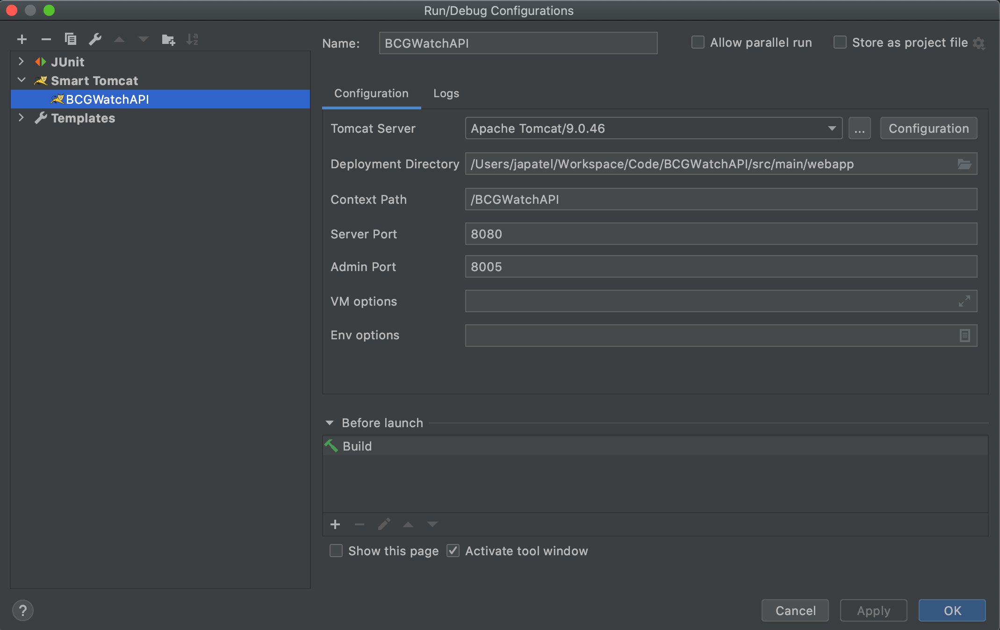
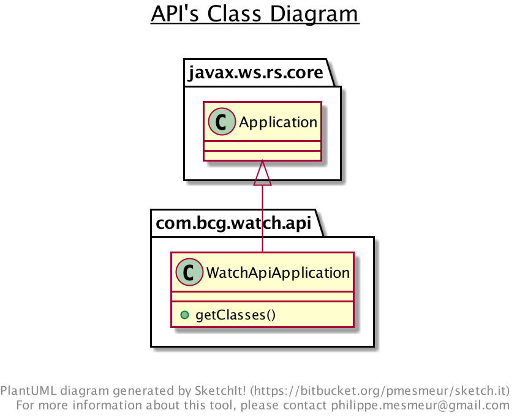
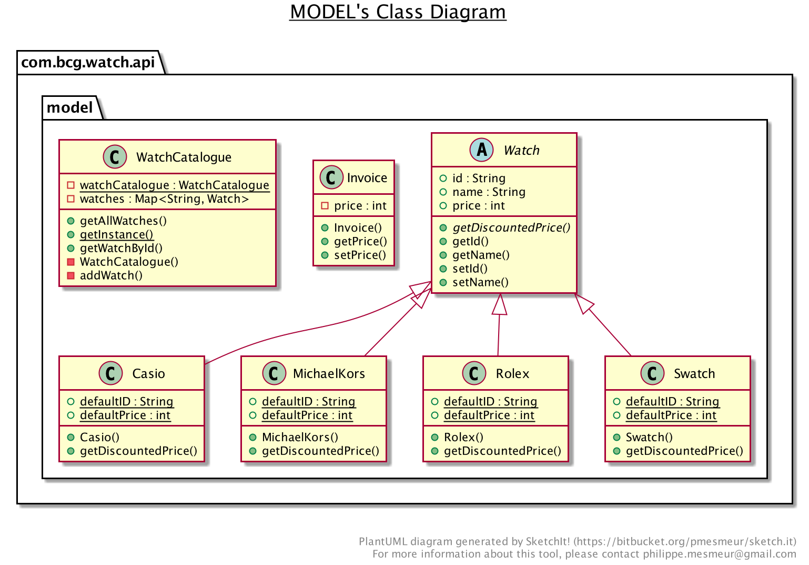
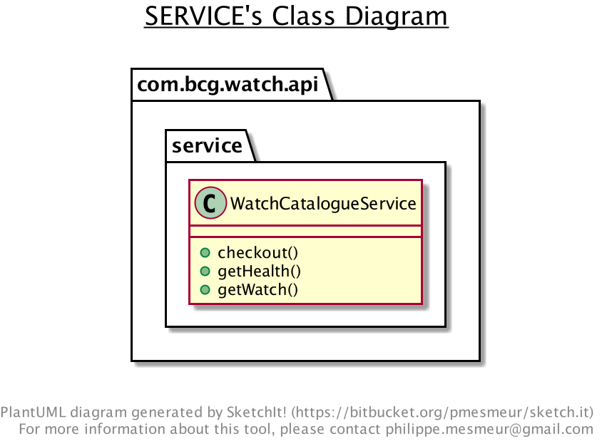
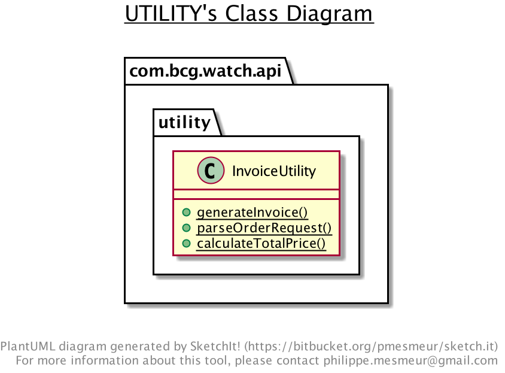
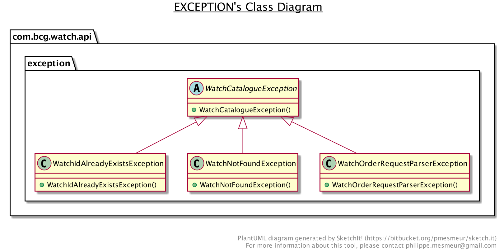

# BCG Coding Challenge - Watch Catalogue API

This repository contains the implementation of a simplified e-commerce API using below technologies:

* [JDK 1.8](https://docs.oracle.com/javase/8/docs/api/) Java Development Kit 8
* [ReastEasy](https://docs.jboss.org/resteasy/docs/3.0.6.Final/userguide/html_single/index.html) implementation of JAX-RS specifications 
* [Apache Tomcat](http://tomcat.apache.org/) or an equivalent application server
* [Maven](https://maven.apache.org/) - Build & dependency Management tool


## Getting Started

Below instructions would help you in setting up the project on your local machine for testing and development.

### Prerequisites

1. **JDK 8**: This API is developed using JDK 8 and hence, it must be installed on the local machine.
Execute below command to check the version of java installed on your machine.

```
java -version
```

output of the above command on development machine -

```
openjdk version "1.8.0_242"
OpenJDK Runtime Environment (AdoptOpenJDK)(build 1.8.0_242-b08)
OpenJDK 64-Bit Server VM (AdoptOpenJDK)(build 25.242-b08, mixed mode)
```

2. **Application Server**: For the development and testing of this API, you would need an application server to host this
application locally. Follow this [instructions](https://tomcat.apache.org/tomcat-9.0-doc/setup.html) for installing **Tomcat** on your local machine. 
   
   **Note**: Tomcat is used for demonstration in the following steps. 


### Setting up project on local machine

This repository can be downloaded as a compressed file on your local machine or cloned 
using git as shown below:

1. Navigate to the target folder and execute below command:

```
git clone https://github.com/avaniss/BCGWatchAPI.git
```

2. Navigate to the root folder of the repository, and execute below command to compile the project and run all the unit tests:

```
mvn clean install
```
3. Now this project can be imported the IDE of your choice.</br>
**Note**: Intellij is used for demonstration in the following steps.

## Deployment

To run this application on your local machine:

 1. Install [**SmartTomcat**](https://plugins.jetbrains.com/plugin/9492-smart-tomcat) plugin in intellij 
 2. Create a run configuration as shown below:

   
 3. Run the application using the above configuration.</br>
 4. Once the application is up and running on the server, open your web browser and 
navigate to- [http://localhost:8080/health](http://localhost:8080/health)
    
      If the application is successfully deployed, you will get the below response from the server:

```
Status: OK
```

## Endpoints

* [http://localhost:8080/health](http://localhost:8080/health) - [GET] Returns ```Status:OK``` if the service is up and running.
* [http://localhost:8080/watches](http://localhost:8080/watches) - [GET] Returns all the available watches as below:
```json
[{
   "price": 100,
   "name": "Rolex",
   "id": "001"
}, {
   "price": 80,
   "name": "MichaelKors",
   "id": "002"
}, {
   "price": 50,
   "name": "Swatch",
   "id": "003"
}, {
   "price": 30,
   "name": "Casio",
   "id": "004"
}]
```

* [http://localhost:8080/checkout](http://localhost:8080/checkout) - [POST] Accepts request payload in ```application/json```.

Sample request :

```["001","001","001","002","002","002","003","004"]```

Output [Content-type ```application/json```]:

```json
{
   "price": 480
}
```

## Implementation approach

1. Creation of project structure:
   * **Application**: ```com.bcg.watch.api.WactchApiApplication``` is the application class.
      


   * **model**:  All model classes resides under the ```com.bcg.watch.api.model.*``` package, these classes only holds data
   and does not perform any application logic themselves.
       

   * **service** package consists ```com.bcg.watch.api.service.WatchCatalogueService``` service/controller class where the service endpoints are defined.
    
   
   * **utility** package consists ```com.bcg.watch.api.utility.InvoiceUtility``` class which is responsible for parsing the **Watch Order Request** and generate invoice.
    
   
   * **exception** package consists ```com.bcg.watch.api.exception.*``` custom exceptions.
    

2. RestEasy is used for the implementation of RestAPI as it implements the JAX-RS specification which is widely used by
java developers for implementing API according to REST standards. Using JAX-RS specification also makes migration of
project from one framework to another simple and straight forward, example switching from RestEasy to Jersey.

3. **Tomcat** is used as the application server for the sake of simplicity and compatibility that comes with the use of ***SmartTomcat*** intellij plugins.

## Future Improvements

* Implementation of detailed integration and acceptance tests.
* Adding capabilities of CI/CD
* Adding Java docs for public interfaces and methods
